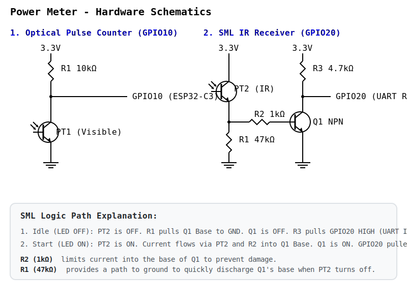

# Power Meter — Hardware Schematics



## 1. Optical Pulse Counter (GPIO10)

Detects the blinking LED on the electricity meter (typically red, 5000 imp/kWh).


**How it works:**
- LED off → PT1 off → R1 pulls GPIO10 **high**
- LED blinks → PT1 conducts → GPIO10 pulled **low**
- ESPHome config uses `inverted: true` + `falling_edge: INCREMENT` to count pulses

> **R1 tuning**: Start with 10kΩ. If the meter LED is dim or far from the sensor, increase to 47kΩ–100kΩ for more sensitivity. If you get false triggers from ambient light, decrease to 4.7kΩ.

---

## 2. SML IR Receiver (GPIO20 — UART RX)

Receives 9600 baud SML data from the smart meter's D0 infrared optical interface (880nm IR).

A bare phototransistor can sometimes be too slow for clean UART edges at 9600 baud. Adding an NPN transistor provides sharp transitions. To maintain the correct UART polarity (Light OFF = Idle = HIGH) without needing software inversion, the phototransistor drives the NPN's base from the high side:


**How it works:**
- **PT2** (IR phototransistor, e.g. SFH 309 FA, TEFT4300): receives 880nm IR from the meter.
- **Idle (Light OFF)**: PT2 is off. The base of Q1 is pulled to GND by R1. Q1 stays OFF. R3 pulls GPIO20 **HIGH** (UART Idle state).
- **Start Bit (Light ON)**: PT2 conducts. Current flows from 3.3V through PT2 and R2 into the base of Q1. Q1 turns ON, pulling GPIO20 **LOW** (UART Start bit).
- **R1** (47kΩ) acts as a pull-down to ensure Q1 turns off quickly.
- **R2** (1kΩ) limits the base current to Q1 when PT2 is fully on.

> **Mounting**: The phototransistor must sit directly on the meter's optical interface (the round lens, usually labeled with the D0 symbol ◉). Use a magnet ring or 3D-printed holder to keep it aligned. Ambient IR (sunlight, fluorescent lights) will corrupt data if the sensor isn't shielded.

---

## 3. ESP32-C3 Pin Summary

```text
  ESP32-C3-DevKitM-1
  ┌─────────────────────┐
  │                     │
  │  GPIO10 ◄────────── Pulse counter (PT1 + R1)
  │                     │
  │  GPIO20 (RX) ◄───── SML IR receiver (PT2 + Q1)
  │  GPIO21 (TX)        (unused, SML is read-only)
  │                     │
  │  3.3V ─────────────► Power to both circuits
  │  GND ──────────────► Common ground
  │                     │
  └─────────────────────┘
```

---

## 4. Bill of Materials

| Ref | Component | Value | Notes |
|-----|-----------|-------|-------|
| **Pulse counter** ||||
| PT1 | Phototransistor (visible) | BPW96C / TEPT5700 | Match to meter LED wavelength (usually red ~630nm) |
| R1 | Resistor | 10kΩ | Pull-up, adjust for sensitivity |
| **SML IR receiver** ||||
| PT2 | Phototransistor (IR) | SFH 309 FA / TEFT4300 | 880nm, matches SML D0 interface |
| R1 | Resistor | 47kΩ | Base pull-down, ensures fast turn-off for Q1 |
| R2 | Resistor | 1kΩ | Base current limiter |
| R3 | Resistor | 4.7kΩ | Pull-up for UART idle-high |
| Q1 | NPN transistor | BC547 / 2N3904 | Signal conditioner |

> **Caution**: Do **not** use the same phototransistor type for both circuits. PT1 needs a visible-light sensor (red), PT2 needs an IR sensor (880nm).
